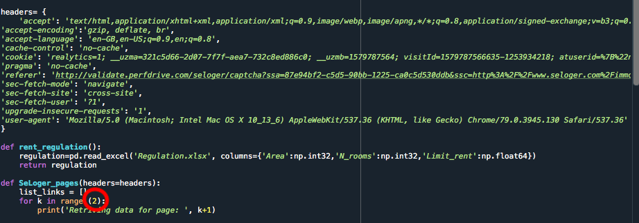

# Flag-illegal-rent-pricing-in-Paris

## Objective

In July 2019, Paris CityHall released the ALUR Regulation setting reference rent pricing in the French capital. As my first project, I decided to web scrap SeLoger.com (1st website for renting an appartment in Paris) and compare each ad to the increased reference m2 price set by the ALUR Regulation.

The general principle of this framework was to define a maximum value of rent per m² applicable to new signed leases, called increased reference rent or “max limit”

## Conclusion

My work shows an astonishing amount of links web scraped being overpriced.
This conclusion is coherent with recent article published in the LeParisien stating that 50% of available apartments in Paris are not respecting the ALUR Regulation.
- [For French Speakers] : (http://www.leparisien.fr/immobilier/encadrement-des-loyers-a-paris-une-annonce-sur-deux-est-illegale-27-01-2020-8245101.php)
- [For English Speakers] The Independent describes the ongoing war between Paris CityHall and Airbnb regarding the multinational's illegal rent pricing strategies: (https://www.independent.co.uk/travel/news-and-advice/airbnb-paris-illegal-rental-lawsuit-adverts-france-holiday-a8773386.html)

## Documents

- Regulation.xlsx : Documentation on max limit per size and district
- SeLoger_Web_Scraping.py: Code on Spyder using HTML web scraping methodology and a Pipeline
- Watch_list.txt : Recording links not respecting reference price set by Paris ALUR regulation

## Initialise

1. Modify headers with your own REQUEST HEADERS by doing the following:

2. Modify in SeLoger_Web_Scraping.py the number of pages you want to web scrap:

## You Run It, You Get It !
From your terminal, run the file and get your Watch_list.txt send out to your file ! 
